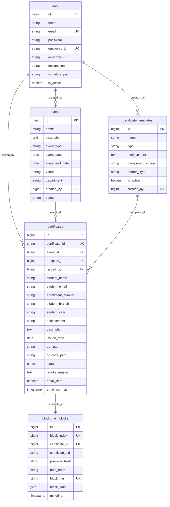
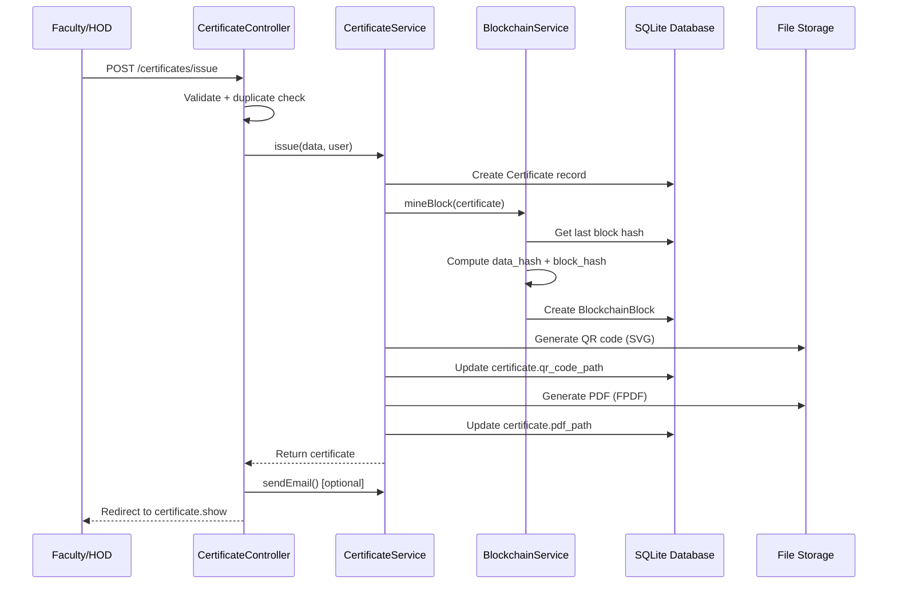

# ⛓ CertChain — Architecture Walkthrough

## Overview

**CertChain** is a **Laravel 11** web application that lets colleges issue, manage, and publicly verify academic certificates using a **simulated blockchain** (SHA-256 hash chain stored in SQLite). Every certificate issued is recorded as a block on an append-only chain, making tampering detectable.

---

## Tech Stack

| Layer | Technology |
|---|---|
| Framework | **Laravel 11** (PHP 8.2+) |
| Database | **SQLite** ([database.sqlite](file:///Users/macbook/Documents/Dtop/certchain/database/database.sqlite)) |
| Auth & Roles | **Spatie Laravel Permission** (4 roles: `admin`, `hod`, `faculty`, `coordinator`) |
| PDF Generation | **FPDF** (raw PHP PDF — used for final certificate PDFs) |
| HTML Templates | **DomPDF** (available but the actual PDF pipeline uses FPDF) |
| QR Codes | **SimpleSoftwareIO/SimpleQrCode** (SVG format) |
| Email | **Gmail SMTP** via Laravel Mail |
| Frontend | **Blade templates** with inline CSS (no JS build tooling / no Vite / no Tailwind) |

---

## Database Schema (7 Migrations)



### Key Relations

- **User → Events** (one-to-many via `created_by`)
- **User → Certificates** (one-to-many via `issued_by`)
- **Event → Certificates** (one-to-many)
- **CertificateTemplate → Certificates** (one-to-many)
- **Certificate → BlockchainBlock** (one-to-one) — each cert gets exactly one block

---

## Roles & Access Control

Managed by [Spatie Permission](file:///Users/macbook/Documents/Dtop/certchain/config/permission.php) with a `role:admin` middleware guard:

| Role | Capabilities |
|---|---|
| **admin** | Full access: user CRUD, template CRUD, blockchain ledger, dashboard stats |
| **hod** | Create events, issue/bulk-issue certificates, download/email certs, revoke |
| **faculty** | Same as HOD (scoped to own certs only in list views) |
| **coordinator** | Same as faculty |

> [!NOTE]
> The only hard role gate is `role:admin` on the `/admin/*` routes. Faculty/HOD/Coordinator share the same authenticated routes — the `CertificateController@index` scopes the query to `issued_by = auth()->id()` for non-admins.

---

## Service Layer (Business Logic)

### [BlockchainService](file:///Users/macbook/Documents/Dtop/certchain/app/Services/BlockchainService.php)

The core of the system — a **simulated blockchain**:

```
GENESIS (0000...0000)
    ↓
Block #1: data_hash + prev_hash → block_hash (SHA-256)
    ↓
Block #2: data_hash + prev_hash → block_hash
    ↓
Block #N: ...
```

| Method | Purpose |
|---|---|
| [mineBlock()](file:///Users/macbook/Documents/Dtop/certchain/app/Services/BlockchainService.php#L20-L66) | Creates a new block for a certificate. Runs inside a DB transaction. Builds a data snapshot (cert_id, student info, event, issuer, date, achievement), computes `data_hash = SHA256(json)`, then `block_hash = SHA256(index + prev_hash + data_hash + timestamp)` |
| [verifyCertificate()](file:///Users/macbook/Documents/Dtop/certchain/app/Services/BlockchainService.php#L72-L147) | 3-step verification: (1) recompute block hash → check integrity, (2) verify chain linkage to previous block, (3) recompute data hash from current DB values → detect tampering |
| [validateChain()](file:///Users/macbook/Documents/Dtop/certchain/app/Services/BlockchainService.php#L152-L177) | Full-chain audit — iterates all blocks checking hash integrity + chain linkage |
| [generateCertificateId()](file:///Users/macbook/Documents/Dtop/certchain/app/Services/BlockchainService.php#L182-L187) | Generates IDs like `CERT-2024-ABC12345` |

---

### [CertificateService](file:///Users/macbook/Documents/Dtop/certchain/app/Services/CertificateService.php)

The **certificate lifecycle pipeline**:

| Method | Purpose |
|---|---|
| [issue()](file:///Users/macbook/Documents/Dtop/certchain/app/Services/CertificateService.php#L18-L49) | Full pipeline: create DB record → mine blockchain block → generate QR code → generate PDF |
| [bulkIssue()](file:///Users/macbook/Documents/Dtop/certchain/app/Services/CertificateService.php#L51-L71) | Loop wrapper around `issue()` with error collection per student |
| [generateQRCode()](file:///Users/macbook/Documents/Dtop/certchain/app/Services/CertificateService.php#L73-L85) | Creates SVG QR code pointing to the public verify URL, saved to `storage/app/public/qrcodes/` |
| [generatePDF()](file:///Users/macbook/Documents/Dtop/certchain/app/Services/CertificateService.php#L87-L232) | **FPDF-based** landscape A4 certificate with navy borders, gold accents, student info, event details, signature lines, block hash, and verify URL. Saved to `storage/app/public/certificates/` |
| [sendEmail()](file:///Users/macbook/Documents/Dtop/certchain/app/Services/CertificateService.php#L234-L261) | Emails the PDF as an attachment via Gmail SMTP |

> [!IMPORTANT]
> The PDF generation uses **raw FPDF** (not DomPDF), despite templates having HTML content. The HTML templates (stored in `certificate_templates.html_content`) are used for **web preview** only, while the PDF is built pixel-by-pixel in PHP. The `/fix-pdfs` utility route in [web.php](file:///Users/macbook/Documents/Dtop/certchain/routes/web.php#L112-L135) regenerates all PDFs.

---

## Certificate Issuance Flow



---

## Controllers & Routes

### Public Routes (No Auth)

| Route | Controller | Purpose |
|---|---|---|
| `GET /` | redirect → verify.index | Homepage redirects to verification portal |
| `GET /verify` | [VerifyController@index](file:///Users/macbook/Documents/Dtop/certchain/app/Http/Controllers/VerifyController.php#L15-L18) | Public search form |
| `POST /verify/search` | [VerifyController@search](file:///Users/macbook/Documents/Dtop/certchain/app/Http/Controllers/VerifyController.php#L20-L41) | Search by cert ID or enrollment number |
| `GET /verify/{id}` | [VerifyController@certificate](file:///Users/macbook/Documents/Dtop/certchain/app/Http/Controllers/VerifyController.php#L44-L52) | Direct verify link (from QR code) |

### Auth Routes

| Route | Controller | Purpose |
|---|---|---|
| `GET /login` | [AuthController@showLogin](file:///Users/macbook/Documents/Dtop/certchain/app/Http/Controllers/AuthController.php#L10-L13) | Login form |
| `POST /login` | [AuthController@login](file:///Users/macbook/Documents/Dtop/certchain/app/Http/Controllers/AuthController.php#L15-L38) | Auth with role-based redirect |
| `POST /logout` | [AuthController@logout](file:///Users/macbook/Documents/Dtop/certchain/app/Http/Controllers/AuthController.php#L41-L47) | Logout |

### Authenticated Routes (`auth` middleware)

| Route | Controller | Purpose |
|---|---|---|
| `GET /dashboard` | [FacultyController@dashboard](file:///Users/macbook/Documents/Dtop/certchain/app/Http/Controllers/FacultyController.php#L13-L31) | Personal stats, recent certs, events |
| `GET /profile` | [FacultyController@profile](file:///Users/macbook/Documents/Dtop/certchain/app/Http/Controllers/FacultyController.php#L33-L36) | Edit profile, signature upload |
| `resource /events` | [EventController](file:///Users/macbook/Documents/Dtop/certchain/app/Http/Controllers/EventController.php) | Full CRUD for events (except show) |
| `GET /certificates` | [CertificateController@index](file:///Users/macbook/Documents/Dtop/certchain/app/Http/Controllers/CertificateController.php#L22-L48) | List certs (scoped for non-admins) |
| `GET /certificates/issue` | [CertificateController@create](file:///Users/macbook/Documents/Dtop/certchain/app/Http/Controllers/CertificateController.php#L51-L56) | Single issue form |
| `POST /certificates/issue` | [CertificateController@store](file:///Users/macbook/Documents/Dtop/certchain/app/Http/Controllers/CertificateController.php#L58-L97) | Issue + blockchain record |
| `GET /certificates/bulk` | [CertificateController@bulkCreate](file:///Users/macbook/Documents/Dtop/certchain/app/Http/Controllers/CertificateController.php#L100-L105) | Bulk issue form |
| `POST /certificates/bulk` | [CertificateController@bulkStore](file:///Users/macbook/Documents/Dtop/certchain/app/Http/Controllers/CertificateController.php#L107-L131) | Bulk issue pipeline |
| `GET /certificates/{id}` | [CertificateController@show](file:///Users/macbook/Documents/Dtop/certchain/app/Http/Controllers/CertificateController.php#L134-L139) | Certificate detail + verification status |
| `GET /certificates/{id}/download` | [CertificateController@download](file:///Users/macbook/Documents/Dtop/certchain/app/Http/Controllers/CertificateController.php#L141-L152) | Regenerates + downloads PDF |
| `POST /certificates/{id}/email` | [CertificateController@sendEmail](file:///Users/macbook/Documents/Dtop/certchain/app/Http/Controllers/CertificateController.php#L154-L161) | Email cert to student |
| `POST /certificates/{id}/revoke` | [CertificateController@revoke](file:///Users/macbook/Documents/Dtop/certchain/app/Http/Controllers/CertificateController.php#L164-L175) | Soft-revoke with reason |

### Admin Routes (`auth` + `role:admin` middleware, `/admin/*`)

| Route | Controller | Purpose |
|---|---|---|
| `GET /admin/dashboard` | [AdminController@dashboard](file:///Users/macbook/Documents/Dtop/certchain/app/Http/Controllers/Admin/AdminController.php#L18-L40) | Global stats, chain status, monthly chart |
| `GET /admin/blockchain` | [AdminController@blockchain](file:///Users/macbook/Documents/Dtop/certchain/app/Http/Controllers/Admin/AdminController.php#L124-L129) | Full blockchain ledger viewer |
| `CRUD /admin/users` | [AdminController](file:///Users/macbook/Documents/Dtop/certchain/app/Http/Controllers/Admin/AdminController.php#L43-L121) | User management |
| `CRUD /admin/templates` | [TemplateController](file:///Users/macbook/Documents/Dtop/certchain/app/Http/Controllers/Admin/TemplateController.php) | Certificate template CRUD + live preview |

---

## Models

| Model | File | Key Features |
|---|---|---|
| [User](file:///Users/macbook/Documents/Dtop/certchain/app/Models/User.php) | Uses `HasRoles` trait, has events + certificates |
| [Event](file:///Users/macbook/Documents/Dtop/certchain/app/Models/Event.php) | Has many certificates, tracks creator |
| [Certificate](file:///Users/macbook/Documents/Dtop/certchain/app/Models/Certificate.php) | Core model — belongs to event, template, issuer; has one blockchain block; `isValid()` helper, `verification_url` accessor |
| [CertificateTemplate](file:///Users/macbook/Documents/Dtop/certchain/app/Models/CertificateTemplate.php) | Stores HTML templates with `{{placeholder}}` syntax; `render()` method does string replacement |
| [BlockchainBlock](file:///Users/macbook/Documents/Dtop/certchain/app/Models/BlockchainBlock.php) | `isIntact()` method recomputes hash to verify integrity; `block_data` is JSON cast |

---

## Views Structure

```
resources/views/
├── layouts/
│   └── app.blade.php              ← Main layout with sidebar navigation
├── auth/
│   └── login.blade.php            ← Login page
├── admin/
│   ├── dashboard.blade.php        ← Admin stats + monthly chart
│   ├── blockchain.blade.php       ← Blockchain ledger viewer
│   ├── users/                     ← User CRUD views
│   └── templates/                 ← Template CRUD views
├── faculty/
│   ├── dashboard.blade.php        ← Faculty stats + recent activity
│   ├── profile.blade.php          ← Profile editor
│   └── events/                    ← Event CRUD views
├── certificates/
│   ├── index.blade.php            ← Certificate listing with search/filter
│   ├── create.blade.php           ← Single issue form
│   ├── bulk.blade.php             ← Bulk issue table form
│   └── show.blade.php             ← Certificate detail + verification badge
├── verify/
│   ├── index.blade.php            ← Public search portal
│   └── result.blade.php           ← Verification result page
└── emails/
    └── certificate.blade.php      ← Email template for cert delivery
```

---

## File Storage Layout

```
storage/app/public/
├── certificates/          ← Generated PDFs (e.g., CERT-2024-ABC123.pdf)
├── qrcodes/               ← QR code SVGs (e.g., CERT-2024-ABC123.svg)
└── signatures/            ← Uploaded faculty signature images
```

Symlinked via `php artisan storage:link` → `public/storage/`

---

## Utility/Debug Routes

> [!WARNING]
> These are development-only routes currently in [web.php](file:///Users/macbook/Documents/Dtop/certchain/routes/web.php#L12-L135) and should be removed before production:

| Route | Purpose |
|---|---|
| `GET /fix-template` | Bulk-updates all template HTML content |
| `GET /check-template` | Dumps first template's HTML |
| `GET /preview-cert` | Renders first certificate using its template |
| `GET /fix-pdfs` | Regenerates QR codes and PDFs for all certificates |

---

## Seeded Data

The [DatabaseSeeder](file:///Users/macbook/Documents/Dtop/certchain/database/seeders/DatabaseSeeder.php) creates:

- **4 roles**: admin, hod, faculty, coordinator
- **3 users**: Admin (`admin@college.edu`), HOD (`hod.cs@college.edu`), Faculty (`faculty@college.edu`)
- **2 certificate templates**: "Participation Certificate" (navy/gold classic) and "Achievement Certificate" (dark gradient modern)

---

## Summary

CertChain is a well-structured, monolithic Laravel app with a clear separation of concerns:

- **Service layer** handles all business logic (blockchain + certificate pipeline)
- **Controllers** are thin — they validate, delegate to services, and return views
- **Simulated blockchain** provides tamper detection via SHA-256 hash chains
- **Dual rendering**: HTML templates for web preview, FPDF for downloadable PDFs
- **Role-based access**: Spatie Permission with 4 roles and route-level middleware
- **Public verification**: No-login-required portal with QR code support

Let me know what you'd like to do with it — I'm ready to help with features, fixes, or improvements!
